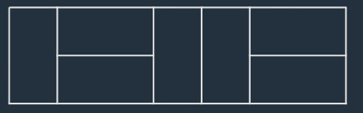
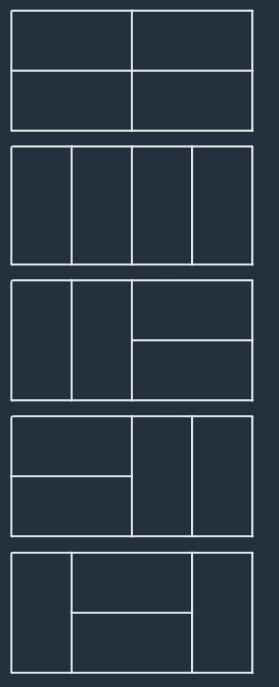

# [level 2] 2 \* n 타일링 - 12900

<a href="https://school.programmers.co.kr/learn/courses/30/lessons/12900">- 문제링크</a>

## 성능 요약

메모리: 0.47MB, 시간: 33.5ms

## 구분

코딩테스트 연습 > 연습문제

## 채점 결과

정확성: 100.0
합계: 100.0 / 100.0

## 문제 설명

가로 길이가 2이고 세로의 길이가 1인 직사각형모양의 타일이 있습니다. 이 직사각형 타일을 이용하여 세로의 길이가 2이고 가로의 길이가 n인 바닥을 가득 채우려고 합니다. 타일을 채울 때는 다음과 같이 2가지 방법이 있습니다.

- 타일을 가로로 배치 하는 경우
- 타일을 세로로 배치 하는 경우

예를들어서 n이 7인 직사각형은 다음과 같이 채울 수 있습니다.

직사각형의 가로의 길이 n이 매개변수로 주어질 때, 이 직사각형을 채우는 방법의 수를 return 하는 solution 함수를 완성해주세요.

---

#### 제한사항

- 가로의 길이 n은 60,000이하의 자연수 입니다.
- 경우의 수가 많아 질 수 있으므로, 경우의 수를 1,000,000,007으로 나눈 나머지를 return해주세요.

#### 입출력 예

| **n** | **result** |
| :---: | :--------: |
|   4   |     5      |

#### 입출력 예 설명

- 입출력 예 #1

다음과 같이 5가지 방법이 있다.

---

> 출처 : 프로그래머스 코딩 테스트 연습, <https://school.programmers.co.kr/learn/challenges>
