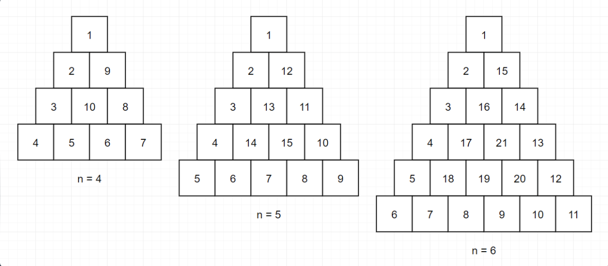

# [level 2] 삼각 달팽이 - 68645

<a href="https://school.programmers.co.kr/learn/courses/30/lessons/68645">- 문제링크</a>

## 성능 요약

메모리: 0.07MB, 시간: 33.4ms

## 구분

코딩테스트 연습 > 월간 코드 챌린지 시즌1

## 채점 결과

정확성: 100.0
합계: 100.0 / 100.0

## 문제 설명

정수 n이 매개변수로 주어집니다. 다음 그림과 같이 밑변의 길이와 높이가 n인 삼각형에서 맨 위 꼭짓점부터 반시계 방향으로 달팽이 채우기를 진행한 후, 첫 행부터 마지막 행까지 모두 순서대로 합친 새로운 배열을 return 하도록 solution 함수를 완성해주세요.

---

#### 제한사항

- n은 1 이상 1,000 이하입니다.

#### 입출력 예

| **n** |                       **result**                        |
| :---: | :-----------------------------------------------------: |
|   4   |                 [1,2,9,3,10,8,4,5,6,7]                  |
|   5   |          [1,2,12,3,13,11,4,14,15,10,5,6,7,8,9]          |
|   6   | [1,2,15,3,16,14,4,17,21,13,5,18,19,20,12,6,7,8,9,10,11] |

---

> 출처 : 프로그래머스 코딩 테스트 연습, <https://school.programmers.co.kr/learn/challenges>
