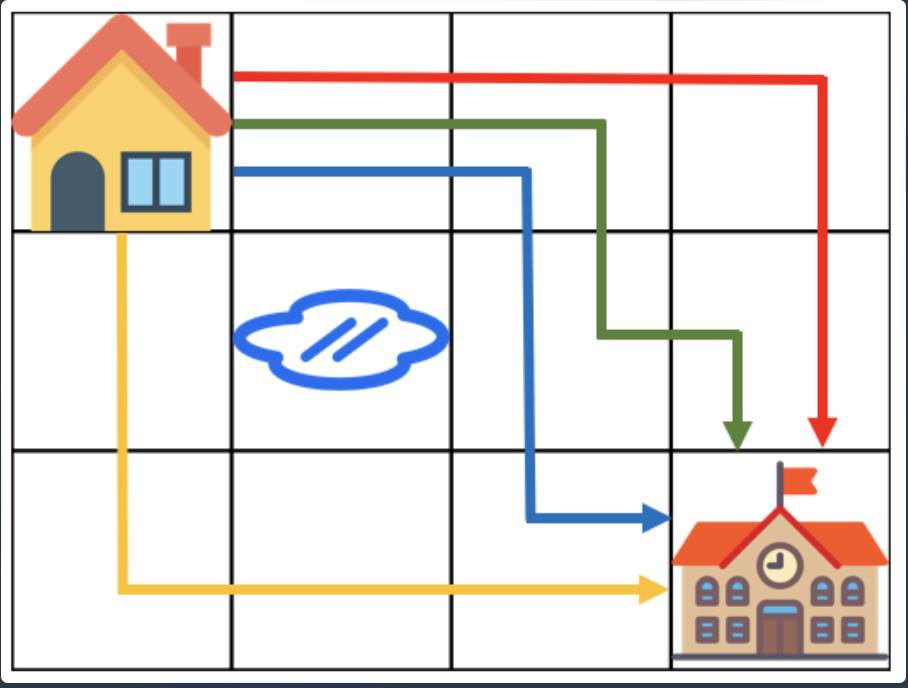

# [level 3] 등굣길 - 42898

<a href="https://school.programmers.co.kr/learn/courses/30/lessons/42898">- 문제링크</a>

## 성능 요약

메모리: 33.5MB, 시간: 0.20ms

## 구분

코딩테스트 연습 > 연습 문제

## 채점 결과

정확성: 100.0
합계: 100.0 / 100.0

## 문제 설명

계속되는 폭우로 일부 지역이 물에 잠겼습니다. 물에 잠기지 않은 지역을 통해 학교를 가려고 합니다. 집에서 학교까지 가는 길은 m x n 크기의 격자모양으로 나타낼 수 있습니다.
아래 그림은 m = 4, n = 3 인 경우입니다.

가장 왼쪽 위, 즉 집이 있는 곳의 좌표는 (1, 1)로 나타내고 가장 오른쪽 아래, 즉 학교가 있는 곳의 좌표는 (m, n)으로 나타냅니다.
격자의 크기 m, n과 물이 잠긴 지역의 좌표를 담은 2차원 배열 puddles이 매개변수로 주어집니다. 오른쪽과 아래쪽으로만 움직여 집에서 학교까지 갈 수 있는 최단경로의 개수를 1,000,000,007로 나눈 나머지를 return 하도록 solution 함수를 작성해주세요.

---

#### 제한 사항

- 격자의 크기 m, n은 1 이상 100 이하인 자연수입니다.
  - m과 n이 모두 1인 경우는 입력으로 주어지지 않습니다.
- 물에 잠긴 지역은 0개 이상 10개 이하입니다.
- 집과 학교가 물에 잠긴 경우는 입력으로 주어지지 않습니다.

#### 입출력 예제

| **m** | **n** | **puddles** | **result** |
| :---: | :---: | ----------- | ---------- |
|   4   |   3   | [[2, 2]]    | 4          |

#### 입출력 예 설명

